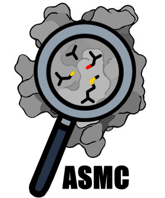

<!--  -->
<!-- center and resize the image with html syntax -->
<p align="center">
  
</p>

# Active Site Modeling and Clustering (ASMC)

ASMC combines (i) homology modeling of family members (MODELLER), (ii) ligand-binding pocket search (P2RANK), (iii) structural alignment of modeled active sites (USalign) and (iv) density-based spatial clustering of obtained alignments (DBSCAN) in a single command line. Clustering step can be carried out on either structural or sequence alignment.

<!--  -->
<!-- center and resize the image with html syntax -->
<p align="center">
  
</p>

## Installation

### Installation with conda and pip

Download the latest GitHub release to obtain the code ([https://github.com/labgem/ASMC/releases](https://github.com/labgem/ASMC/releases)) and extract the code from the archive.

Then, use the following commands from the ASMC/ directory:
```
conda env create -n asmc -f env.yml
pip install ./
```

Conda will install all the python dependencies and two required third-party softwares:
- MODELLER (you still need to request the license key)
- USalign

The pip command is required to create the `asmc` command and use ASMC.

It's also possible to use only the `pip install ./` command, but this will not install any third party software.

### Third party Software dependencies

- P2RANK - for ligand-binding pocket detection ([https://github.com/rdk/p2rank](https://github.com/rdk/p2rank))
- MODELLER - for homology modeling ([https://salilab.org/modeller/](https://salilab.org/modeller/))
- USalign - for structural alignment ([https://github.com/pylelab/USalign](https://github.com/pylelab/USalign))

#### P2RANK setup

Download the p2rank tar.gz file (e.g: p2rank_2.5.tar.gz) and extract the archive.

Create a symbolic link to the prank script, e.g:
```
ln -s p2rank_2.5/prank /usr/bin/prank
```

Modify the script to work with a symbolic link. At line 22, replace:
```bash
THIS_SCRIPT_DIR_REL_PATH=`dirname "${BASH_SOURCE[0]}"`
```
by
```bash
THIS_SCRIPT_DIR_REL_PATH=$(dirname "$(readlink -f "${BASH_SOURCE[0]}")")
```

Now, ASMC can use P2RANK to detect ligand binding pockets.

### Docker Image

Download the Docker image in the latest GitHub release: [https://github.com/labgem/ASMC/releases](https://github.com/labgem/ASMC/releases)

Then, use the following command to load an image from the archive:
```
docker load -i asmc-latest.tar
```

## Quick Usage

Run ASMC in a blind way (unknown active site) using a multi fasta file that should contain at least 100 sequences for clustering to be sufficiently relevant.

```
asmc run --log run_asmc.log --threads 6 -r reference_file -s sequences.fasta
```

`reference_file` should contains the path to the reference(s) structure(s), e.g:
```
<path>/RefA.pdb
<path>/RefB.pdb
```

NB: For more details, see the [wiki](https://github.com/labgem/ASMC/wiki/Options-and-Usages)
